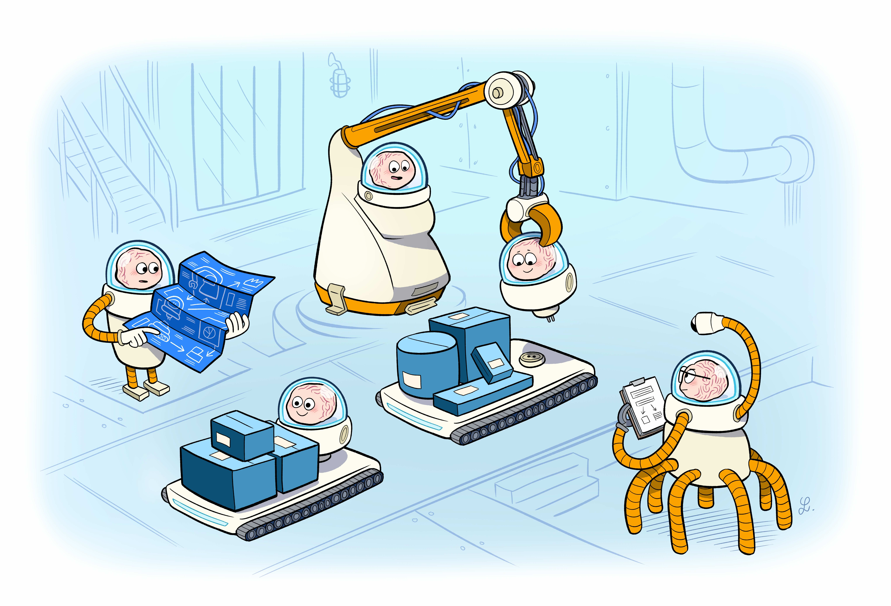

## Dagger is more than push and flow

### More solutions for CI

Dagger solves more than the "push-and-pray" problem in CI.
It also introduces a way for developers to directly write tests in the coding language they are comfortable in by utilizing software developement kits (SDKs).
At the moment Dagger offers SDKs for the following coding languages: Go, Python, Typescript, PHP (experimental), Rust (experimental) and the newest addition [Java](https://dagger.io/blog/java-sdk) (experimental).

The Dagger SDKs translate your code/functions internally into GraphQL API calls to communicate with the DAG in the Dagger RunTime.

To increase the quality and efficiency, tandardized Dagger functions are shared in the [Daggerverse](https://daggerverse.dev/), so you don't have to write your own code to for example, run a k3s server that can be accessed both locally and in your pipelines or to utilize helm and many more.

Running your CI pipeline locally with Dagger also helps you be more efficient by cutting down on the pipeline wait times by utilizing caching. Like this you can avoid unnecessary rebuilds and test reruns when nothing has changed. Only rerunning the parts of your pipeline that you changed.

To increase colaboration and visualize your pipelines you can use Dagger Cloud.

All these feature allow you to be platform independent, as it can run on any hosting provider that can run containers.

### Dagger for AI agents

This new feature of Dagger promises to make your CI experience easier than ever before, utilizing AI agents.

Dagger harnesses the power of LLMs and uses them as tooling agents, to complete small tasks in your pipeline and communicate with each other.

You could for example reference the container which runs your build and let the AI agent pipe out the build result from the log file. This AI agent now calls on the tools needed to complete this task. Other AI agents can "pick" up the output and interact with it depending on their own constraints.

From this you can add on complexity until your pipeline looks something like this:

